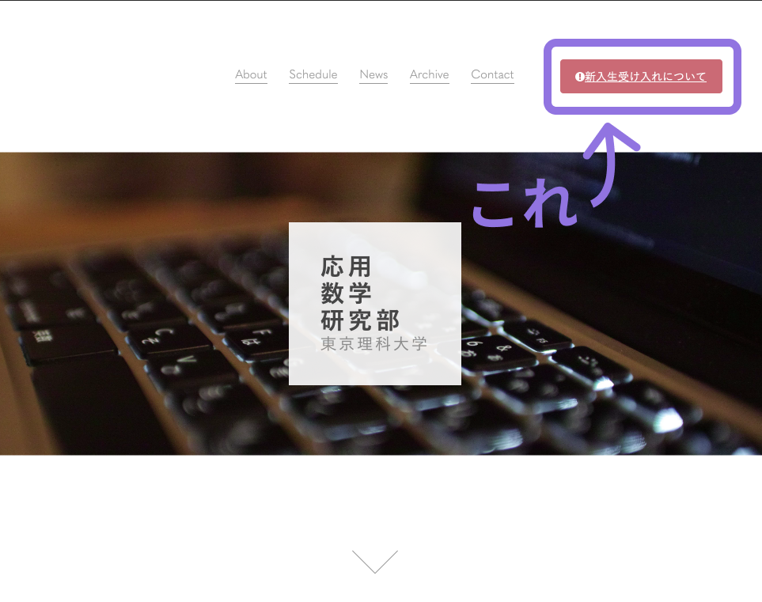

# 設定の編集について
ここはページの設定に関するjsonファイルがあります。

## バルーン
バルーンとはトップページに表示される告知文のことです。


一つのみ表示する告知文を設定できます。
以下の情報を設定します。

```json
{
  "label": "{ラベル名}",
  "path": "{そのページのパス}"
}
```

- `label`: バルーンに表示される告知文のラベル。

- `path`: その告知文のパス。例えば`https://oskt.us/articles/2020/about`へのリンクにしたい場合は`/articles/2020/about`と記述する

## サイトのメタ情報

```json
{
  "title_prefix": "{サイトのtitleに全ページで共通してつける接頭辞}"
}
```

- `title_prefix`: ブラウザーのタイトルバーやページのタブに表示される文書の題名の全ページ共通の接頭辞